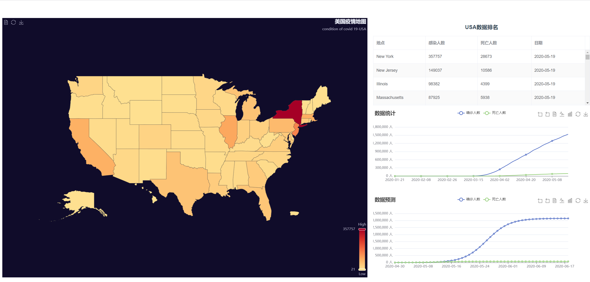
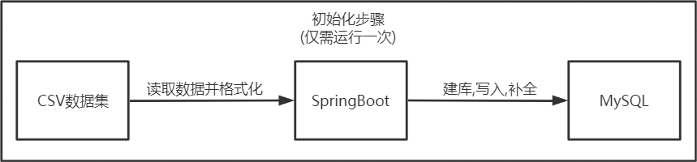
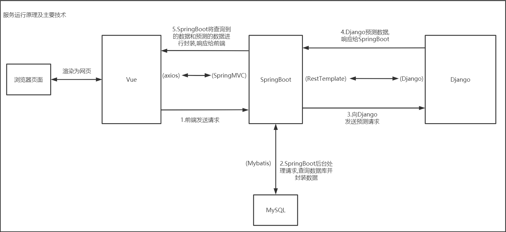

## Demo演示:

### http://121.5.169.34/

## 说明:

**Django部署在8000端口**

**SpringBoot部署在8088端口**

**前端使用nginx映射80端口**

**已经在云服务器成功上线**

## 运行流程:

#### 初始化:

#### 运行:

## 文件说明:

**dist.tar           :       前端项目打包**

**forecast.tar  :       Django后台打包**

**demo.jar       :       SpringBoot后台打包**

**covid.sql       :       数据库sql文件,可快速建立数据库**

